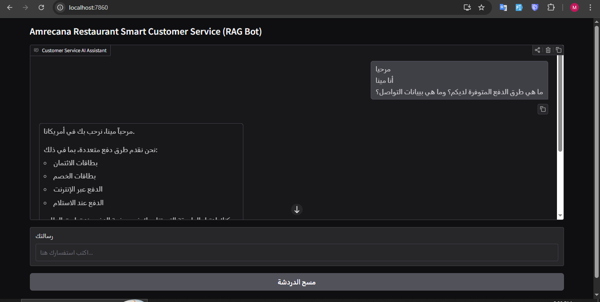
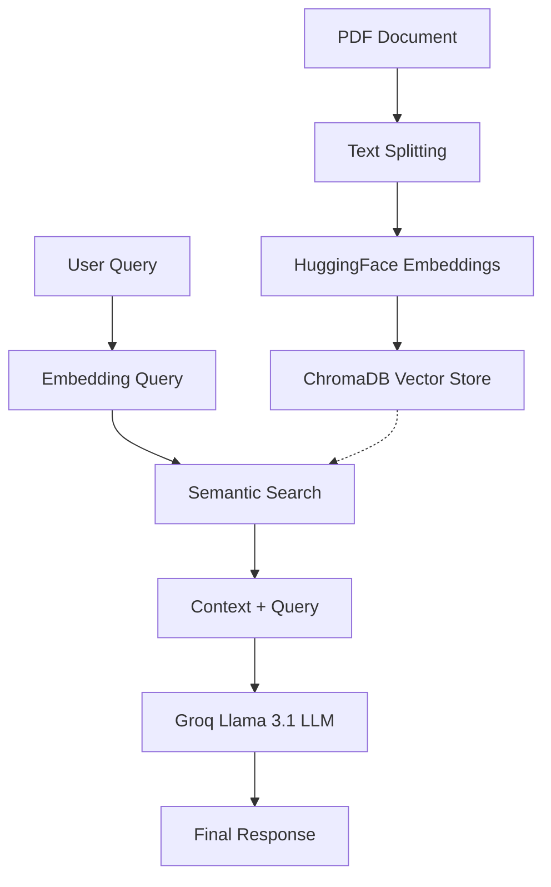

# Amricana AI: Smart Customer Service (RAG Bot)



Amricana AI is a Retrieval-Augmented Generation (RAG) chatbot designed to act as a restaurant customer service assistant. It leverages a PDF document (e.g., Privacy Policy or FAQs) to provide accurate, context-aware answers to user inquiries in real-time.

---

## 🧩 How it Works (RAG Architecture)



---

## 🚀 Features

- **Context-Aware Responses**: Uses LangChain and ChromaDB to retrieve relevant information from a specific PDF document.
- **Multilingual Support**: Automatically detects and matches the user's language (Arabic, English, etc.) using the `multilingual-e5-small` embedding model.
- **Fast Inference**: Powered by **Groq** (using the `llama-3.1-8b-instant` model) for near-instant responses.
- **User-Friendly Interface**: Built with **Gradio**, offering a clean and interactive chat UI.
- **Containerized Deployment**: Fully Dockerized for easy setup and consistent performance across environments.

---

## 🛠️ Tech Stack

- **Framework**: [LangChain](https://www.langchain.com/)
- **LLM Provider**: [Groq](https://groq.com/) (Llama 3.1)
- **Vector Database**: [ChromaDB](https://www.trychroma.com/)
- **Embeddings**: [HuggingFace](https://huggingface.co/) (`intfloat/multilingual-e5-small`)
- **Frontend**: [Gradio](https://gradio.app/)
- **Containerization**: Docker & Docker Compose

---

## 📋 Prerequisites

Before running the application, ensure you have the following installed:
- [Docker](https://www.docker.com/get-started)
- [Docker Compose](https://docs.docker.com/compose/install/)
- A **Groq API Key** (Get one at [console.groq.com](https://console.groq.com/))

---

## ⚙️ Setup & Installation

### 1. Clone the Repository
```bash
git clone <repository-url>
cd AmricanaAI
```

### 2. Environment Configuration
Create a `.env` file in the root directory and add your Groq API key:
```env
GROQ_API_KEY=your_groq_api_key_here
```

### 3. Data Preparation
Place your source PDF file in the `data/` folder. By default, the app expects a file named `Privacy-Policy-Ar.pdf`.
- If your file has a different name, update the `PDF_PATH` variable in `app.py`.

### 4. Run with Docker Compose
Run the following command to build and start the container:
```bash
docker-compose up --build
```

---

## 🖥️ Usage

Once the container is running, the application will be accessible at:
**[http://localhost:7860](http://localhost:7860)**

You can now interact with the bot. It will index the PDF document on startup and use it as the source of truth for all customer service queries.

---

## 📁 Project Structure

```text
AmricanaAI/
├── data/               # Source PDF documents
├── chroma_db/          # Persistent vector database storage
├── models_cache/       # Cache for HuggingFace models
├── app.py              # Main application logic (LangChain + Gradio)
├── DockerFile          # Docker configuration
├── docker-compose.yaml # Docker Compose orchestration
└── .env                # Environment variables (API Keys)
```

---

## 📝 Notes
- The application clears and rebuilds the ChromaDB vector store on every launch to ensure it always uses the latest version of the provided PDF.
- Responses are strictly limited to the information found within the PDF context. If the information is missing, the bot will suggest contacting human support.

